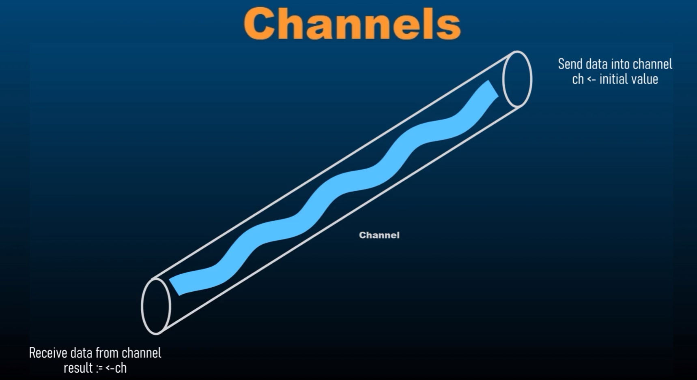

# Understanding Unbuffered and Buffered Channels in Go

This guide explains the fundamental differences between unbuffered and buffered channels in Go, focusing on their runtime behavior and use cases. Understanding this distinction is crucial for writing effective and efficient concurrent programs.

## Table of Contents

- [Unbuffered Channels](#unbuffered-channels)
  - [Core Concept](#core-concept)
  - [Code Example](#code-example)
  - [Runtime Mechanism Explained](#runtime-mechanism-explained)
- [Buffered Channels](#buffered-channels)
  - [Core Concept](#core-concept-1)
  - [Why Use Buffered Channels?](#why-use-buffered-channels)
- [Summary: Key Differences](#summary-key-differences)

---

## Unbuffered Channels

By default, channels created in Go are **unbuffered**. This means they have no capacity to hold any values. They are purely mechanisms for synchronization and direct value transfer.

### Core Concept

An unbuffered channel requires a sender and a receiver to be ready at the exact same time for a communication to occur. This is often called a **"rendezvous"**.

- A **send** operation on an unbuffered channel will **block** until a corresponding receiver is ready.
- A **receive** operation on an unbuffered channel will **block** until a corresponding sender is ready.

This synchronous behavior guarantees that a message is handed off directly from one goroutine to another.



### Code Example

The following code demonstrates the blocking nature of an unbuffered channel.

```go
package main

import (
	"fmt"
	"time"
)

func main() {
	// Create an unbuffered channel of type int.
	// By default, make(chan T) creates an unbuffered channel.
	ch := make(chan int)

	// Start a new goroutine to send a value to the channel.
	go func() {
		// This send operation will block until the main goroutine is ready to receive.
		ch <- 1
		fmt.Println("Sender has sent the value and is now unblocked.")
	}()

	// The main goroutine blocks here, waiting to receive a value from the channel.
	fmt.Println("Main goroutine is waiting to receive...")
	rcvr := <-ch

	// Once the value is received, the main goroutine is unblocked and can proceed.
	fmt.Println("Receiver got the value:", rcvr)
	time.Sleep(2 * time.Second) // Wait to see the sender's message
}
```

### Runtime Mechanism Explained

Let's break down the execution flow of the code above:

1.  **Channel Creation:** The `main` goroutine creates an unbuffered channel `ch`.
2.  **Goroutine Launch:** The Go runtime sees the `go` keyword and launches a new, anonymous function in a separate goroutine. The `main` goroutine does not wait and immediately moves to the next line.
3.  **Receiver Blocks:** The `main` goroutine reaches the line `rcvr := <-ch`. Since this is a receive operation on an unbuffered channel and no sender is ready yet, the **`main` goroutine blocks**. It pauses its execution until a value is sent to `ch`.
4.  **Sender Blocks:** Meanwhile, the newly created goroutine executes and reaches `ch <- 1`. It attempts to send the value `1` to the channel. Since there is a receiver (`main` goroutine) waiting, the runtime orchestrates the transfer. The sender blocks momentarily until the handover is complete.
5.  **The "Rendezvous" (Value Transfer):** The Go runtime facilitates the direct transfer of the value `1` from the sender goroutine to the `main` goroutine's `rcvr` variable.
6.  **Unblocking:** As soon as the value is transferred, **both goroutines are unblocked** and can continue their execution independently.
7.  **Execution Continues:** The `main` goroutine prints the received value. The sender goroutine proceeds to its next line and prints its confirmation message.

---

## Buffered Channels

A buffered channel has an associated storage capacity. It allows the channel to hold a limited number of values before blocking the sender.

### Core Concept

You create a buffered channel by providing a capacity as the second argument to `make()`:

```go
// Creates a buffered channel that can hold up to 10 integers.
ch := make(chan int, 10)
```

- A **send** operation on a buffered channel will only **block** if the buffer is **full**.
- A **receive** operation will only **block** if the buffer is **empty**.

This allows for asynchronous communication between goroutines.

### Why Use Buffered Channels?

Buffered channels are preferred over unbuffered channels in specific scenarios because they can decouple the sender and receiver.

- **Asynchronous Communication:** The most significant advantage is that they allow the sender to continue its work without waiting for an immediate receiver, as long as there is space in the buffer. This can greatly improve performance and throughput.

- **Handling Bursts of Data:** If a producer generates data in bursts, a buffer can absorb these bursts, allowing the consumer to process them at a steady pace without dropping data or blocking the producer.

- **Flow Control and Load Balancing:** Buffered channels can manage the rate of data transfer between producers and consumers, acting as a simple queue to smooth out the data flow and prevent a fast producer from overwhelming a slow consumer.

---

## Summary: Key Differences

| Feature              | Unbuffered Channel                                    | Buffered Channel                                         |
| -------------------- | ----------------------------------------------------- | -------------------------------------------------------- |
| **Creation**         | `make(chan T)`                                        | `make(chan T, capacity)`                                 |
| **Capacity**         | 0                                                     | `capacity` (> 0)                                         |
| **Send Behavior**    | Blocks until a receiver is ready.                     | Blocks only if the buffer is full.                       |
| **Receive Behavior** | Blocks until a sender is ready.                       | Blocks only if the buffer is empty.                      |
| **Communication**    | Synchronous (Guaranteed "handover")                   | Asynchronous (Decouples sender and receiver)             |
| **Primary Use Case** | Synchronization, guaranteeing an action has occurred. | Improving throughput, managing bursty workloads, queues. |
