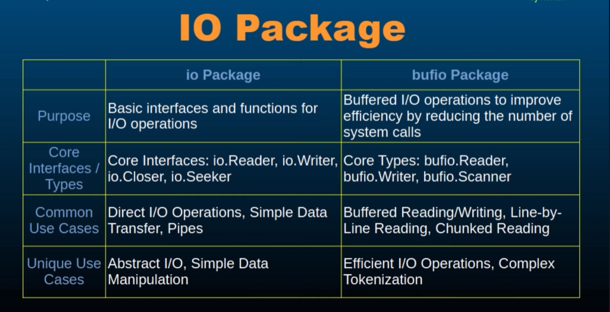

# Go `io` Package Overview

The `io` package is a **standard library package in Go** that provides essential **interfaces and functions for input/output operations**.

---

## Why is the `io` Package Important?

- Facilitates interaction with various data sources:
  - Files
  - Networks
  - In-memory buffers
- Provides a consistent and composable interface for handling I/O operations.

---

## Core Interfaces

### `io.Reader`

- Interface for reading data from a source.
- **Method**: `Read(p []byte) (n int, err error)`
- Common Implementations:
  - `os.File` (from the `os` package)
  - `strings.Reader` (from the `strings` package)
  - `bytes.Buffer`

### `io.Writer`

- Interface for writing data to a destination.
- **Method**: `Write(p []byte) (n int, err error)`
- Common Implementations:
  - `os.File`
  - `strings.Builder`
  - `bytes.Buffer`

### `io.Closer`

- Interface for closing resources.
- **Method**: `Close() error`
- Common Implementations:
  - `os.File`
  - `fs.File`
  - Other types that manage underlying resources

---

## Common Types and Functions

- **`io.Copy(dst Writer, src Reader)`**

  - Copies data from an `io.Reader` to an `io.Writer`
  - Efficient for transferring data between streams

- **`io.MultiReader(r1, r2, ...)`**

  - Returns a single `Reader` to read sequentially from multiple sources

- **`io.Pipe()`**
  - Creates an in-memory synchronous pipe
  - Returns a connected `io.Reader` and `io.Writer`
  - Useful for simulating streaming or piping between goroutines

---

## Working with Buffers

- **`bytes.Buffer`**

  - Implements both `io.Reader` and `io.Writer`
  - Efficient for in-memory data manipulation

- **`bufio` Package**
  - Provides buffered I/O wrappers around `io.Reader` and `io.Writer`
  - Improves performance with large reads/writes

---

## bufio vs io

